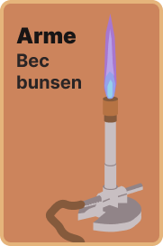
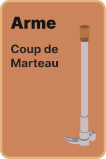

# Qui a détruit le mémoire d'Hector ?
Votre mission, découvrir qui a détruit le mémoire d'Hector, est-ce Olivier Ridoux dans le trou noir avec le bec bunsen ou serait-ce OCaml avec le Café dans la E303?

Découvrez l'ensemble des cartes et explorez la carte dans un jeu de CluedOwO.

## Run
```bash
git clone https://github.com/coco33920/PalmHackaton
cd PalmHackaton
make run
```

Et ouvrir le serveur vue.js (port 5173 ou 5174)

## Warning

Le jeu n'est pas complètement terminé, en effet on n'a pas implémenter les déplacement et le guess du milieu au bureau de la Palme pour terminer la partie, on a pas eu le temps et on était crevé

# Cartes
*Voici la liste des cartes du jeu*
## Armes







## Lieux


## Suspects


# Plateau de Jeu


# Licences
* Images sous licence CC-BY-NC-SA (Bacoin3301)
* Code sous licence GPLv3
